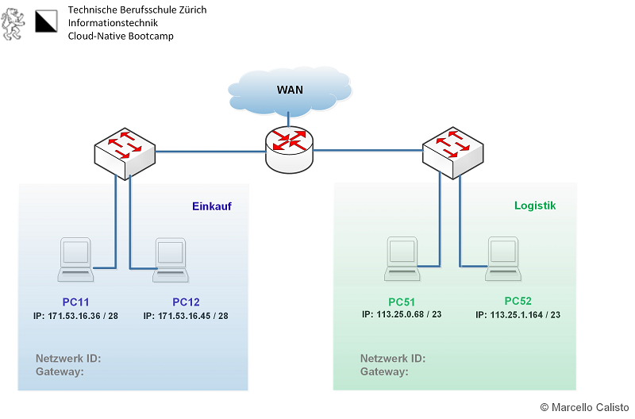

# Cisco Packettrace, Cisco Packettracer or is it Cisco Packet Tracer :question:

</img>


This is the real question all of them.

Answer to this question:
```
there is no wrong or right, we developer know exactly what we are talking about, right?
```

## What does it exactly :question:

CPT is an excellent piece of software for both experienced and inexperienced network administrators. It can do basically everything, like building the complete infrastructure of a firm and testing their network rules, for example, with a firewall or a switch. CPT is often used in schools to test their students in a specific area, such as port forwarding or blocking other things.


## Do I actually use it :sleeping:

To be honest, I never liked Cisco's PacketTracer because it still has the same user interface as it did ten years ago. And that's why I never used it on purpose. But as I grew older, I realized that I shouldn't focus solely on the outside. Now I still don't like it, but it has very nice tools to investigate network troubles. But, to be honest, it can quickly become **very** complicated and complex.


<details>
<summary>Our exercises :school_satchel:</summary>
Here we will have some exercieses regarding CPT
 
### Exercise 6 (Niveau 3 - Expert Skills :sunglasses:)

This was a very simple exercise which was about getting along with the CPT Command Line and some other sub-tasks.

-   Getting along with Command Line :white_check_mark:
-   Name all servers and routers with their IP address / CIDR :white_check_mark:
-   Fill out the routing table for all routers :white_check_mark:
-   Find out how the DHCP works in this scenario :white_check_mark:


### Exercise 7 (Niveau 3 - Expert Skills :yum:)

This exercise was more difficult but still very doable to do. It was more of an process of elimination, fist go to the first notebook and try the ping. If this is not working try it on the second notebook and see the result. So forth and on.. 

I tried these short explained steps to figure out where the issue was located:

-   Ping on site from client, didn't worked - timeout
-   Ping the router, didn't also worked - timeout
-   Listen to trace to client, hops to the first router
-   Listen to trace from server to client, did work

After this I tried to look more into the routing between client and router and after a detailed look I saw there was an entry with an address which was pointing to a non existing address. 

The wrong route entry was deleted and then it worked!


### Exercise 8 (Niveau 3 - Expert Skills :smiling_imp:)

This exercise was actually again a easy one because the main focus was on dealing with dynamic routing.
First things first, this is the network what we should build and get all informations from the network and every device

</img>

## Abteilung Einkauf PC11

| IP Address / Network                                        	| 171 	                                                               | 
|-------------------------------------------------------------	|----------------------------------------------------------------------|
| Address:    171.53.16.36 /28<br>Netmaks:    255.255.255.240 	|    | 128 	| 64 	| 32 	| 16 	| 8 	| 4 	| 2 	| 1 	|  |
|                                                               |    |:---:	|:--:	|:--:	|:--:	|:-:	|:-:	|:-:	|:-:	|  |
|                                                               |    |  1  	|  0 	|  1 	|  0 	| 1 	| 0 	| 1 	| 1 	|  |
|                                                               |    |  1  	|  1 	|  1 	|  1 	| 1 	| 1 	| 1 	| 1 	|  |
| 	                                                            |                                                                      |
| Network-ID: 171.53.16.32 /28                                	|     	                                                               |                        
| 1st. IP:    171.53.16.33 /28                                	|     	                                                               |                        
| Last IP:    171.53.16.46 /28                                	|     	                                                               |                         
| Broadcast:  171.53.16.47 /28                                	|     	                                                               |                         


</details>


| 128 	| 64 	| 32 	| 16 	| 8 	| 4 	| 2 	| 1 	|
|:---:	|:--:	|:--:	|:--:	|:-:	|:-:	|:-:	|:-:	|
|  1  	|  0 	|  1 	|  0 	| 1 	| 0 	| 1 	| 1 	|
|  1  	|  1 	|  1 	|  1 	| 1 	| 1 	| 1 	| 1 	|
